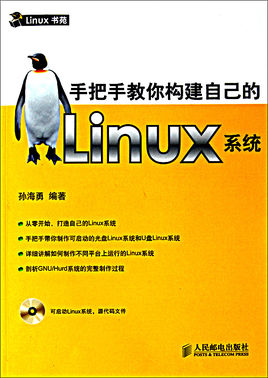

# Linux From Scratch


## 本仓库内容

1. LFS解析笔记

```
Something I hope you know before go into the coding~
First, please watch or star this repo, I'll be more happy if you follow me.
Bug report, questions and discussion are welcome, you can post an issue or pull a request.
```

## 相关站点

* GitHub地址:<https://github.com/yifengyou/lfs>
* GitBook地址:<https://yifengyou.gitbooks.io/lfs/content/>

## 目录


## 思维导图


## 参考博客


## 参考书目




《**手把手教你构建自己的Linux系统**》以如何使用源代码搭建一套Linux系统这一独特的角度介绍Linux系统的构成，主要内容包括走进GNU/Linux、LFS，Linux系统定制原理，制作GNU/Linux系统的准备工作，本地定制GNU/Linux系统——临时系统，本地定制GNU/Linux系统——目标系统，LiveCD/DVD的制作，LiveUSB的制作，交叉编译GNU/Linux系统原理，交叉编译GNU/Linux系统过程，交叉编译GNU/Hurd系统的制作等内容。

## 总结


---
