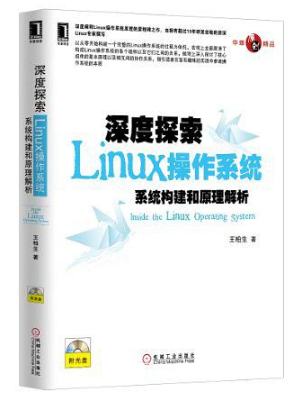

# Linux From Scratch


## 本仓库内容

1. LFS解析笔记

```
Something I hope you know before go into the coding~
First, please watch or star this repo, I'll be more happy if you follow me.
Bug report, questions and discussion are welcome, you can post an issue or pull a request.
```

## 相关站点

* GitHub地址:<https://github.com/yifengyou/lfs>
* GitBook地址:<https://yifengyou.gitbooks.io/lfs/content/>

## 目录

* [准备基本环境](docs/准备基本环境/准备基本环境.md)
* [工具链](docs/工具链/工具链.md)
* [构建内核](docs/构建内核/构建内核.md)
* [构建initramfs](docs/构建initramfs/构建initramfs.md)
* [从内核空间到用户空间](docs/从内核空间到用户空间/从内核空间到用户空间.md)
* [构建根文件系统](docs/构建根文件系统/构建根文件系统.md)
* [构建桌面环境](docs/构建桌面环境/构建桌面环境.md)
* [Linux图形原理探讨](docs/Linux图形原理探讨/Linux图形原理探讨.md)


## 参考书目



《**深度探索linux操作系统：系统构建和原理解析**》是探索linux操作系统原理的里程碑之作，在众多的同类书中独树一帜。它颠覆和摒弃了传统的从阅读linux内核源代码着手学习linux操作系统原理的方式，而是基于实践，以从零开始构建一个完整的linux操作系统的过程为依托，指引读者在实践中去探索操作系统的本质。这种方式的妙处在于，让读者先从宏观上全面认清一个完整的操作系统中都包含哪些组件，各个组件的作用，以及各个组件间的关系，从微观上深入理解系统各个组件的原理，帮助读者达到事半功倍的学习效果，这是作者潜心研究linux操作系统10几年的心得和经验，能避免后来者在学习中再走弯路。此外，本书还对编译链接技术（尤其是动态加载和链接技术）和图形系统进行了原理性的探讨，这部分内容非常珍贵。

《一本俯瞰Linux系统全局的书籍》:<https://book.douban.com/review/6581603/>


## 总结

```
```
